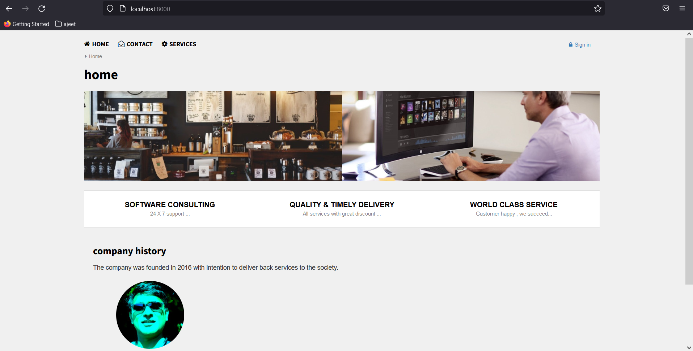
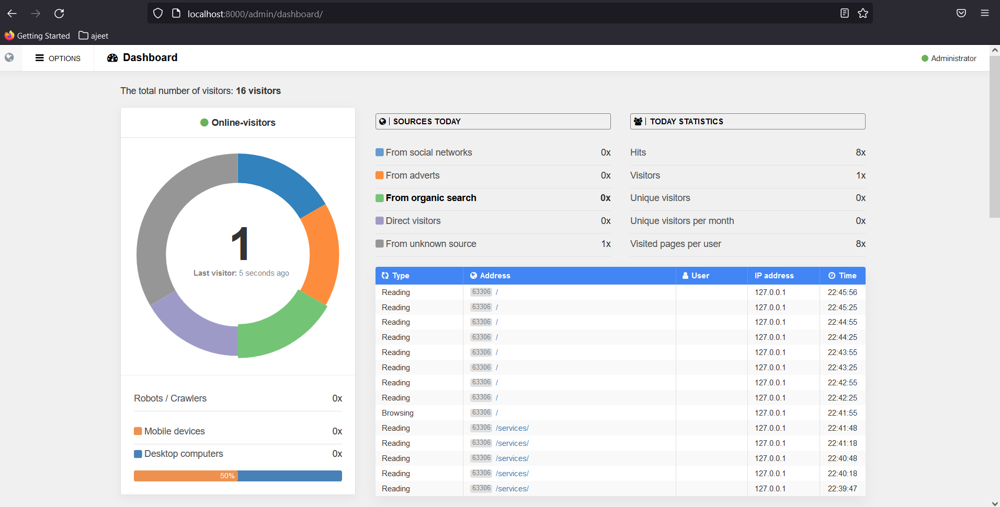

[![MIT License][license-image]][license-url]

# portal

A simple cms based application with Nodejs and nosql

# website view

# admin view

## Installation

- check if you have installed [GraphicsMagick](http://www.graphicsmagick.org/)
- install `$ npm install total.js`

[license-image]: https://img.shields.io/badge/license-MIT-blue.svg?style=flat
[license-url]: license.txt